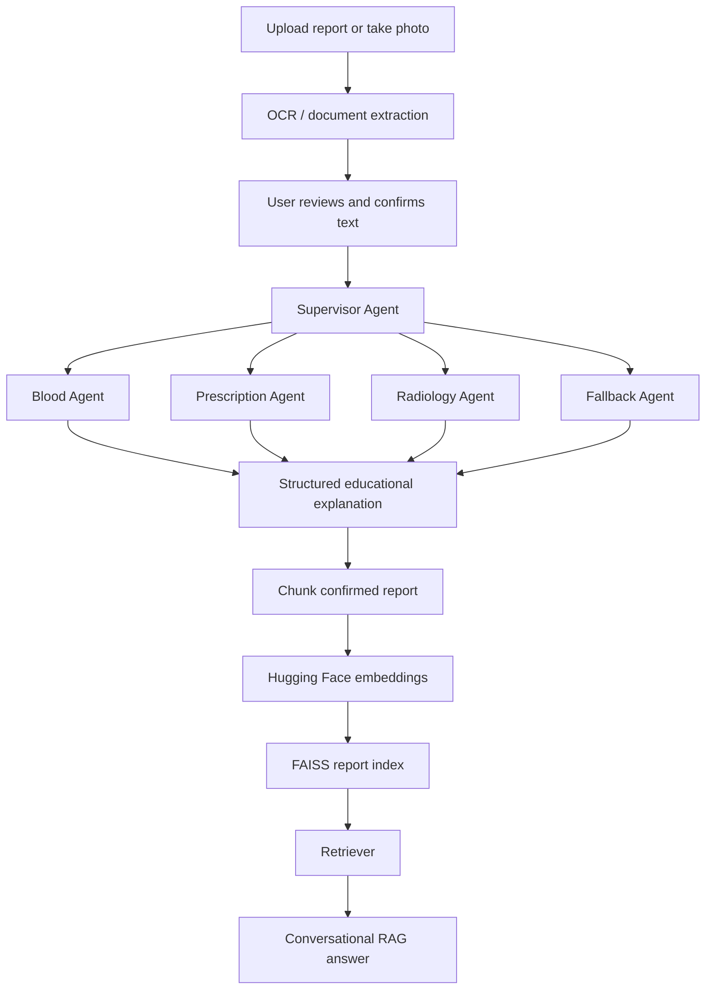

# 🩺 MediSimplify AI

MediSimplify AI is an agentic AI platform that converts complex written medical reports into simple, multilingual, educational explanations. Users can upload a report, review the extracted content, route it to a specialized medical-report agent, and ask grounded follow-up questions using report-specific conversational RAG.

> **Safety notice:** MediSimplify AI is an educational tool. It does not diagnose conditions, prescribe treatment, recommend medication changes, or replace a qualified healthcare professional.

## Current capabilities

- PDF, DOCX, TXT, JPG, JPEG, PNG, WEBP, and camera input
- OCR and multimodal extraction with a user-review step
- Supervisor Agent for report-type routing
- Blood Report, Prescription, Written Radiology, and Fallback agents
- Explanations in English, Hindi, and Punjabi
- Gemini, Groq, and local Ollama provider layer
- FAISS-based report-specific knowledge base
- Hugging Face sentence-transformer embeddings
- Conversational follow-up questions grounded in confirmed report text
- Report-scoped short-term memory, clear-chat, and rebuild controls
- Automated FastAPI tests with mocked external model calls

## Supported reports

| Report type | Status |
|---|---|
| Blood laboratory reports | ✅ Supported |
| Prescriptions | ✅ Supported |
| Written radiology findings | ✅ Supported |
| Mixed or unclear written reports | ✅ Fallback agent |
| Raw X-ray, CT, or MRI image diagnosis | ❌ Not supported |

## Architecture



## Development roadmap

- [x] Phase 1 — Project foundation
- [x] Phase 2 — Report upload, OCR, and confirmation
- [x] Phase 3 — LLM provider abstraction
- [x] Phase 4 — Supervisor Agent and report routing
- [x] Phase 5 — Specialized report explanation agents
- [x] Phase 6 — Conversational RAG and report Q&A
- [ ] Phase 7 — Grandma Mode
- [ ] Phase 8 — Voice conversation
- [ ] Phase 9 — Doctor Visit Pack, deployment, and production polish

## Phase 6 — Conversational RAG

Phase 6 turns the one-time report explanation workflow into an interactive assistant.

### RAG workflow

```text
Confirmed report text
        ↓
Overlapping report chunks
        ↓
all-MiniLM-L6-v2 embeddings
        ↓
FAISS IndexFlatIP
        ↓
Top-k report sections
        ↓
Provider-independent LLM generation
        ↓
Grounded educational answer with source excerpts
```

The knowledge base and conversation history are isolated by `report_id` and kept in memory only. Uploading a new report starts a separate report context. The API automatically builds the knowledge base on the first question, while the UI also provides explicit build and rebuild controls.

### Phase 6 API endpoints

| Method | Endpoint | Purpose |
|---|---|---|
| `POST` | `/api/v1/chat` | Ask a grounded report question |
| `POST` | `/api/v1/chat/{report_id}/knowledge-base` | Build or rebuild the report index |
| `GET` | `/api/v1/chat/{report_id}/status` | Read knowledge-base status |
| `DELETE` | `/api/v1/chat/{report_id}/conversation` | Clear report chat history |
| `DELETE` | `/api/v1/chat/{report_id}/knowledge-base` | Remove the index and chat history |

Example request:

```json
{
  "report_id": "example-report-id",
  "question": "What hemoglobin value is written in my report?",
  "language": "english",
  "preferred_provider": "gemini",
  "top_k": 4
}
```

## Main API endpoints

| Method | Endpoint | Purpose |
|---|---|---|
| `GET` | `/api/v1/health` | Backend health check |
| `POST` | `/api/v1/reports/extract` | Upload and extract report content |
| `POST` | `/api/v1/reports/{report_id}/confirm-analysis` | Save reviewed report text |
| `GET` | `/api/v1/providers/status` | Read provider configuration status |
| `POST` | `/api/v1/providers/test` | Run a small live provider test |
| `POST` | `/api/v1/analysis/route` | Route report to a specialized agent |
| `POST` | `/api/v1/analysis/{report_id}/manual-route` | Save manual report type |
| `POST` | `/api/v1/analysis/explain` | Generate structured report explanation |

## Project structure

```text
MediSimplify-AI/
├── backend/
│   ├── app/
│   │   ├── agents/              # Supervisor and specialized agents
│   │   ├── api/                 # FastAPI route modules
│   │   ├── core/                # Configuration, logging, exceptions
│   │   ├── models/              # Pydantic request/response models
│   │   ├── providers/           # Gemini, Groq, and Ollama adapters
│   │   └── services/            # OCR, routing, analysis, RAG, retrieval
│   ├── tests/
│   ├── .env.example
│   └── requirements.txt
├── frontend/
│   ├── components/
│   ├── services/
│   ├── utils/
│   ├── Home.py
│   └── requirements.txt
└── README.md
```

## Technology stack

| Layer | Technology |
|---|---|
| Backend | FastAPI, Pydantic |
| Frontend | Streamlit |
| OCR / multimodal extraction | Gemini |
| LLM providers | Gemini, Groq, Ollama |
| Embeddings | `sentence-transformers/all-MiniLM-L6-v2` |
| Vector search | FAISS `IndexFlatIP` |
| Document extraction | pypdf, python-docx, Pillow |
| Testing | Pytest, FastAPI TestClient |
| Language | Python |

## Setup

### Prerequisites

- Python 3.10 or newer
- At least one configured LLM provider
- Internet access on first run to download the Hugging Face embedding model

### Backend

```powershell
cd backend
python -m venv venv
.\venv\Scripts\Activate.ps1
python -m pip install --upgrade pip
pip install -r requirements.txt
copy .env.example .env
python -m pytest -q
uvicorn app.main:app --reload --port 8000
```

On Linux or macOS, activate the environment with:

```bash
source venv/bin/activate
```

### Frontend

Open a second terminal:

```powershell
cd frontend
pip install -r requirements.txt
streamlit run Home.py
```

## Environment variables

Copy `backend/.env.example` to `backend/.env` and add only the providers you intend to use.

```env
GEMINI_API_KEY=
GEMINI_MODEL=gemini-2.5-flash

GROQ_API_KEY=
GROQ_MODEL=llama-3.3-70b-versatile

OLLAMA_BASE_URL=http://localhost:11434
OLLAMA_MODEL=llama3.2

DEFAULT_LLM_PROVIDER=gemini
LLM_FALLBACK_PROVIDERS=groq,ollama

EMBEDDING_MODEL=sentence-transformers/all-MiniLM-L6-v2
RAG_CHUNK_SIZE=900
RAG_CHUNK_OVERLAP=140
```

Never commit real API keys.

## Testing

Run the backend test suite from `backend/`:

```bash
python -m pytest -q
```

Current verified result for this Phase 6 build:

```text
36 passed
```

The test suite mocks provider generation and embedding behavior, so normal automated tests do not consume LLM credits or download a model.

## Safety principles

MediSimplify AI:

- uses only user-confirmed report text for analysis and retrieval;
- keeps report values, units, dates, and medication instructions unchanged;
- states when requested information is not present in the report;
- does not diagnose disease;
- does not prescribe treatment or advise medication changes;
- reminds users to consult a qualified healthcare professional for decisions.

## Author

**Kareena Sekhon**

GitHub: `Kareenasekhon`
