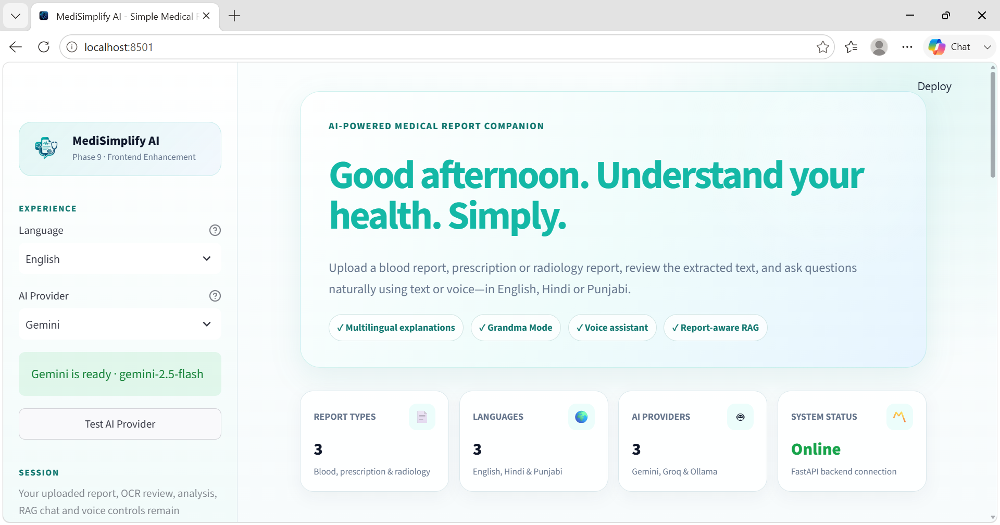
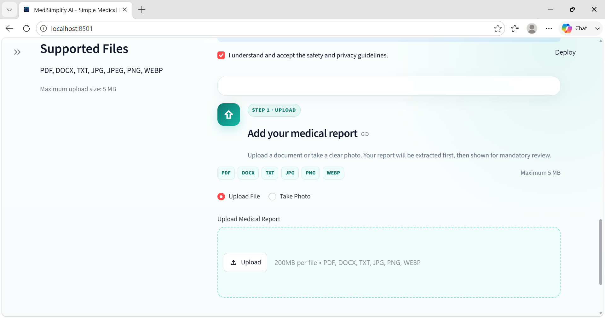
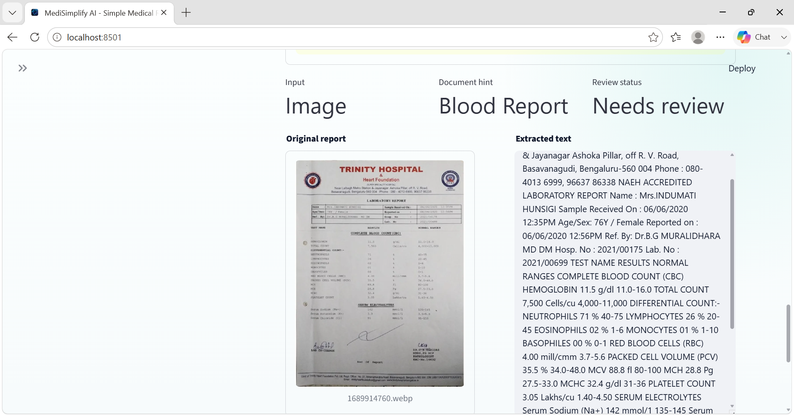
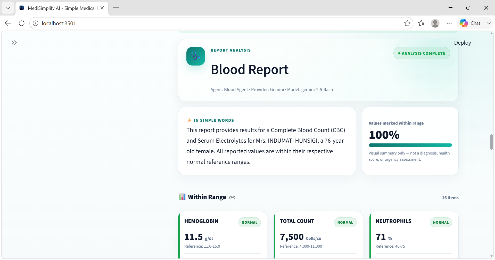
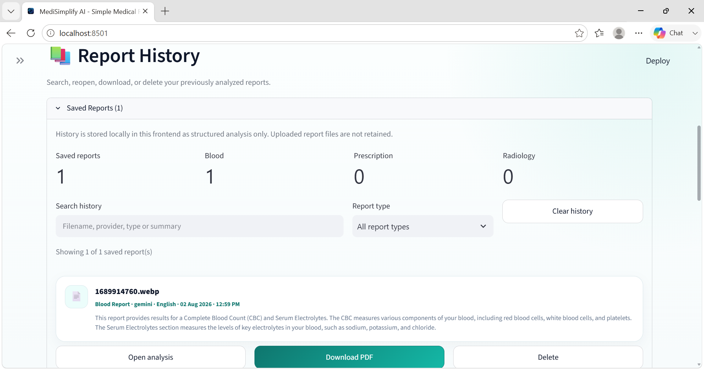
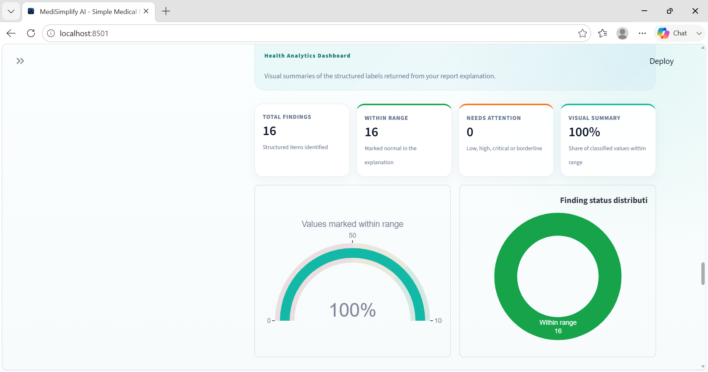
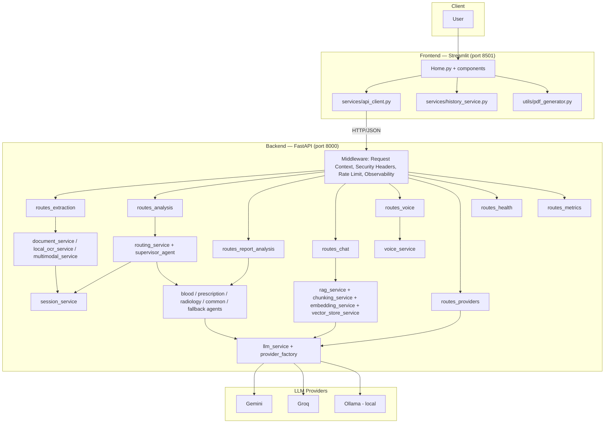
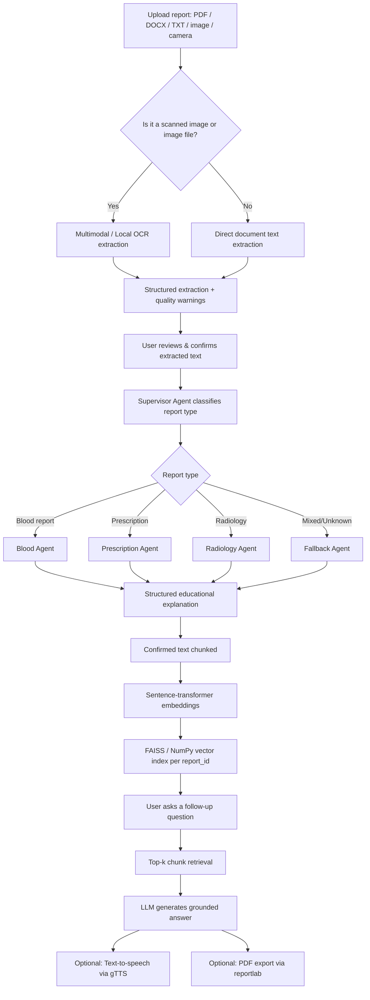

<div align="center">

# 🩺 MediSimplify AI

### Turn confusing medical reports into clear, grounded, multilingual explanations

[](./backend/app/core/constants.py)
[](./backend/Dockerfile)
[](./backend/app/main.py)
[](./frontend/Home.py)
[](./compose.yaml)
[](#license)
[](#roadmap)

</div>

> **⚠️ Educational tool — not a medical device.** MediSimplify AI explains medical reports in plain language for learning purposes. It does not diagnose, prescribe, or replace a licensed healthcare professional. See the [Disclaimer](#-disclaimer).

---

## 📖 Table of Contents

- [Project Overview](#-project-overview)
- [Features](#-features)
- [Screenshots](#-screenshots)
- [System Architecture](#-system-architecture)
- [AI Workflow](#-ai-workflow)
- [Folder Structure](#-folder-structure)
- [Tech Stack](#-tech-stack)
- [Installation](#-installation)
- [API Overview](#-api-overview)
- [Docker](#-docker)
- [Security](#-security)
- [Performance](#-performance)
- [Monitoring](#-monitoring)
- [Cloud Deployment](#-cloud-deployment)
- [Roadmap](#-roadmap)
- [License](#-license)
- [Disclaimer](#-disclaimer)
- [Acknowledgements](#-acknowledgements)

---

## 📌 Project Overview

**Problem statement.** Medical reports — blood panels, prescriptions, radiology findings — are written for clinicians, not patients. Patients frequently receive a PDF or a photographed printout full of abbreviations, reference ranges, and clinical shorthand with no plain-language context.

**Why this project exists.** MediSimplify AI gives people a safe, structured way to *understand* a report they already have, without replacing the advice of the professional who issued it. Every explanation is grounded in the report text the user has personally reviewed and confirmed — nothing is inferred from outside knowledge about the patient.

**Who it is for.** Patients and caregivers who want a plain-language walkthrough of a report before or after a doctor's appointment, in English, Hindi, or Punjabi, with the option to ask follow-up questions or listen to the explanation aloud.

**How it solves the problem.** The application accepts an uploaded or photographed report, extracts and OCRs the text, requires the user to **review and confirm** the extracted content, routes it to a specialized report-type agent for a structured explanation, and then builds a **report-scoped RAG knowledge base** so the user can ask grounded follow-up questions — all backed by a swappable LLM provider layer (Gemini, Groq, or local Ollama).

---

## ✨ Features

### 🧠 AI & Agent Pipeline

| Feature | Description |
|---|---|
| Supervisor Agent | Classifies confirmed report text into a report type before explanation |
| Specialized Agents | `blood_agent`, `prescription_agent`, `radiology_agent`, `common_report_agent`, and a `fallback_agent` for mixed/unclear text |
| Multi-provider LLM layer | Pluggable `gemini`, `groq`, and `ollama` providers behind one interface with configurable fallback order |
| Multilingual explanations | English, Hindi, and Punjabi output (`AnalysisLanguage`) |

### 🔍 OCR & Document Extraction

| Feature | Description |
|---|---|
| Multi-format ingestion | PDF, DOCX, TXT, JPG, JPEG, PNG, WEBP |
| Local OCR fallback | Tesseract-based extraction (`local_ocr_service.py`) for scanned or image-only PDFs |
| Multimodal extraction | Structured extraction directly from images via the multimodal LLM path (`multimodal_service.py`) |
| Image quality checks | Pre-extraction quality validation with actionable warnings (`image_validation_service.py`) |
| User confirmation step | Extracted text must be explicitly reviewed and confirmed before any AI analysis runs |

### 💬 Conversational RAG

| Feature | Description |
|---|---|
| Report-scoped knowledge base | Each `report_id` gets its own isolated chunk index — no cross-report leakage |
| Chunking | Overlapping chunker (`chunking_service.py`) tuned by `RAG_CHUNK_SIZE` / `RAG_CHUNK_OVERLAP` |
| Embeddings | Hugging Face `sentence-transformers` embeddings via `embedding_service.py` |
| Vector search | FAISS-backed (or NumPy fallback) similarity search via `vector_store_service.py` |
| Grounded answers | `rag_service.py` retrieves top-k chunks and generates answers strictly from retrieved report text |
| Conversation memory | Short-term, report-scoped chat memory (`chat_memory_service.py`) with clear/rebuild controls |

### 🎙️ Voice Assistant

| Feature | Description |
|---|---|
| Speech-to-text | `faster-whisper` transcription (`voice_service.py`, configurable model/device/compute type) |
| Text-to-speech | `gTTS`-based spoken responses in the selected analysis language |
| Upload validation | Audio content-type and size validation (`validate_audio_upload`) before transcription |

### 🖥️ Frontend (Streamlit)

| Feature | Description |
|---|---|
| Guided workflow UI | Upload → extraction review → analysis → chat, in `Home.py` |
| Rich components | Parameter cards, health charts, recommendation cards, doctor-visit questions, suggested questions, history panel, and more (see `frontend/components/`) |
| PDF report export | `utils/pdf_generator.py` using `reportlab` |
| Interactive analytics | `plotly`-based health charts (`components/health_charts.py`) |
| Local history | Persisted report history via `services/history_service.py` |

### 🛠️ Backend (FastAPI)

| Feature | Description |
|---|---|
| Modular routers | Extraction, routing/analysis, report explanation, chat/RAG, voice, providers, health, metrics |
| Session service | In-memory report session state between extraction, routing, and analysis steps |
| Structured error handling | Centralized exception types and error handlers (`core/exceptions.py`, `core/error_handlers.py`) |
| Startup validation | Runtime environment validation on boot (`core/startup.py`) |

### 🔐 Security

| Feature | Description |
|---|---|
| Upload validation | Extension allow-list, MIME-type checks, and file-signature verification |
| Rate limiting | In-memory per-route limiter for uploads, chat, and voice endpoints |
| Security headers | `X-Content-Type-Options`, `X-Frame-Options`, CSP/HSTS in production, and more |
| Request IDs | Every response carries an `X-Request-ID` and `X-Process-Time-Ms` header |
| Safe error handling | Errors return structured, secret-free JSON payloads |

### ⚡ Performance

| Feature | Description |
|---|---|
| Provider instance caching | LRU-cached provider adapters (`provider_factory.py`) |
| Embedding query cache | Bounded LRU cache for repeated embedding queries |
| FAISS/vector store reuse | Bounded, LRU-evicted in-memory vector store cache |
| Configurable batching | Embedding batch size, HTTP connection pool sizing |
| Docker layer caching | Pip install layer cached with BuildKit `--mount=type=cache` |

### 📊 Monitoring

| Feature | Description |
|---|---|
| Health endpoints | `/api/v1/health`, `/api/v1/health/live`, `/api/v1/health/ready` |
| Metrics endpoint | `/metrics` (and versioned alias) exposing secret-free, process-local operational metrics |
| Slow request detection | Configurable threshold (`SLOW_REQUEST_THRESHOLD_MS`) tracked per request |
| Structured logging | `loguru`-based logging configuration (`core/logging_config.py`) |

### ☁️ Deployment

| Feature | Description |
|---|---|
| Docker Compose | Two-service local stack (`backend` + `frontend`) with health-gated startup |
| Render | `render.yaml` blueprint for both services with persistent disks |
| Railway | `deployment/railway/*.json` build/deploy configuration |
| Cloud-aware paths | `Settings.cloud_platform` detects Render/Railway and resolves persistent storage paths accordingly |

---

## 🖼️ Screenshots

> Screenshots are not included in this repository. Add your own images to `frontend/assets/` and reference them below.

| View | Preview |
|---|---|
## 📄 Dashboard Report



---
## 📄 Upload Report



---

## 🔍 OCR Review



---

## 📊 AI Analysis



---


## 🎙️ Voice Assistant


---

## 📚 Report History



---

## 📄 Visual Representation



---

## 🏗️ System Architecture



---

## 🔄 AI Workflow



---

## 📁 Folder Structure

```
MediSimplify_AI/
├── backend/
│   ├── app/
│   │   ├── agents/            # Supervisor + specialized report agents
│   │   ├── api/                # FastAPI routers (extraction, chat, voice, health, metrics, providers, analysis)
│   │   ├── core/               # Settings, constants, exceptions, error handlers, startup checks, logging
│   │   ├── middleware/         # Request context, rate limiting, security headers, observability
│   │   ├── models/              # Pydantic request/response and domain models
│   │   ├── providers/          # Gemini, Groq, Ollama LLM provider adapters + factory
│   │   ├── services/            # Business logic: OCR, RAG, chunking, embeddings, vector store, voice, sessions, metrics
│   │   ├── utils/               # File validation, temporary file handling
│   │   └── main.py             # FastAPI app assembly and route registration
│   ├── tests/                   # Pytest suite (unit + integration, mocked external calls)
│   ├── Dockerfile
│   ├── requirements.txt
│   └── start-cloud.sh
├── frontend/
│   ├── components/              # Streamlit UI components (chat, charts, cards, history, export, etc.)
│   ├── services/                # API client + local history persistence
│   ├── utils/                   # PDF generation, UI helpers
│   ├── assets/                  # Logos and stylesheet
│   ├── Home.py                  # Streamlit entry point
│   ├── Dockerfile
│   ├── requirements.txt
│   └── start-cloud.sh
├── deployment/
│   ├── railway/                 # Railway build/deploy JSON configs for backend and frontend
│   ├── CLOUD_DEPLOYMENT_GUIDE.md
│   ├── DOCKER_SETUP.md
│   └── MONITORING_GUIDE.md
├── docs/
│   └── DEVELOPMENT_HISTORY.md
├── compose.yaml                 # Docker Compose stack (backend + frontend)
├── render.yaml                  # Render blueprint (backend + frontend web services)
└── PHASE_*.md                   # Per-phase changelogs and migration notes
```

---

## 🧰 Tech Stack

| Layer | Technology |
|---|---|
| Backend framework | FastAPI, Uvicorn |
| Frontend framework | Streamlit |
| Data validation / config | Pydantic v2, `pydantic-settings` |
| OCR | Tesseract (`pytesseract`), `PyMuPDF` |
| Document parsing | `pypdf`, `python-docx` |
| AI models / LLM providers | Google Gemini (`google-genai`), Groq (`groq`), local Ollama |
| Embeddings | Hugging Face `sentence-transformers` (`all-MiniLM-L6-v2` by default) |
| Vector database | FAISS (`faiss-cpu`), with a NumPy-based in-memory fallback |
| Voice — speech-to-text | `faster-whisper` |
| Voice — text-to-speech | `gTTS` |
| PDF export | `reportlab` |
| Data visualization | `plotly` |
| Deployment | Docker, Docker Compose, Render, Railway |
| Testing | `pytest`, `pytest-asyncio`, `httpx` |
| Logging | `loguru` |
| Numerics | `numpy` |

---

## ⚙️ Installation

### Prerequisites

- Python 3.11+
- (Optional) Tesseract OCR installed locally if not using Docker
- At least one LLM provider key: `GEMINI_API_KEY`, `GROQ_API_KEY`, or a running local Ollama instance

### Local Installation

**Backend**

```bash
cd backend
python -m venv venv
source venv/bin/activate        # Windows: venv\Scripts\activate
pip install -r requirements.txt
cp .env.example .env            # then fill in your provider keys
uvicorn app.main:app --reload --host 127.0.0.1 --port 8000
```

**Frontend**

```bash
cd frontend
python -m venv venv
source venv/bin/activate        # Windows: venv\Scripts\activate
pip install -r requirements.txt
cp .env.example .env
streamlit run Home.py
```

The backend serves on `http://127.0.0.1:8000` and the frontend on `http://localhost:8501`.

### Docker Installation

```bash
# From the repository root
cp backend/.env.example backend/.env
# Fill in backend/.env with your provider keys

docker compose up --build
```

This starts both services defined in `compose.yaml`:

- `backend` → `http://localhost:8000`
- `frontend` → `http://localhost:8501`

### Environment Variables

Environment variables are defined and validated in `backend/app/core/config.py`. Key groups (see `backend/.env.example` and `frontend/.env.example` for the full list):

| Variable | Purpose |
|---|---|
| `APP_ENV`, `DEBUG`, `HOST`, `PORT`, `LOG_LEVEL` | Core runtime configuration |
| `ALLOWED_ORIGINS`, `ALLOW_CREDENTIALS` | CORS configuration |
| `GEMINI_API_KEY`, `GROQ_API_KEY`, `OLLAMA_ENABLED` | LLM provider credentials |
| `DEFAULT_LLM_PROVIDER`, `LLM_FALLBACK_PROVIDERS` | Provider selection and fallback order |
| `LOCAL_OCR_ENABLED`, `TESSERACT_CMD`, `OCR_STRUCTURING_PROVIDER` | OCR configuration |
| `EMBEDDING_MODEL`, `RAG_CHUNK_SIZE`, `RAG_CHUNK_OVERLAP` | RAG configuration |
| `VOICE_TRANSCRIPTION_ENABLED`, `VOICE_SPEECH_ENABLED`, `VOICE_WHISPER_MODEL` | Voice assistant configuration |
| `SECURITY_HEADERS_ENABLED`, `RATE_LIMIT_ENABLED`, `RATE_LIMIT_*_PER_MINUTE` | Security hardening |
| `METRICS_ENABLED`, `SLOW_REQUEST_THRESHOLD_MS` | Monitoring |
| `PERSISTENT_DATA_DIR`, `MODEL_CACHE_DIR` | Cloud-friendly storage paths |
| `BACKEND_API_URL` / `BACKEND_API_HOSTPORT` (frontend) | Backend connection for the Streamlit app |

---

## 🔌 API Overview

All routes are mounted under `/api/v1` unless noted otherwise. Full interactive documentation is available at `/docs` when `API_DOCS_ENABLED=true`.

| Method | Endpoint | Description |
|---|---|---|
| `GET` | `/` | Basic API navigation info |
| `GET` | `/api/v1/health` | Backward-compatible service health check |
| `GET` | `/api/v1/health/live` | Liveness probe |
| `GET` | `/api/v1/health/ready` | Readiness probe (storage, LLM provider, vector store, OCR, voice) |
| `GET` | `/metrics` | Secret-free operational metrics snapshot |
| `POST` | `/api/v1/reports/extract` | Upload a report file and extract text (OCR/multimodal as needed) |
| `POST` | `/api/v1/reports/{report_id}/confirm-analysis` | Store the user-reviewed/confirmed extraction |
| `POST` | `/api/v1/analysis/route` | Route a confirmed report through the Supervisor Agent |
| `POST` | `/api/v1/analysis/{report_id}/manual-route` | Manually override the routed report type |
| `POST` | `/api/v1/analysis/explain` | Generate the structured educational explanation |
| `POST` | `/api/v1/chat` | Ask a grounded follow-up question about a confirmed report |
| `GET` | `/api/v1/chat/{report_id}/suggested-questions` | Get suggested follow-up questions |
| `POST` | `/api/v1/chat/{report_id}/knowledge-base` | Build or rebuild the report's RAG index |
| `GET` | `/api/v1/chat/{report_id}/status` | Get knowledge-base build status |
| `DELETE` | `/api/v1/chat/{report_id}/conversation` | Clear the report's conversation history |
| `DELETE` | `/api/v1/chat/{report_id}/knowledge-base` | Delete the report's index and conversation history |
| `GET` | `/api/v1/voice/status` | Voice assistant capability status |
| `POST` | `/api/v1/voice/transcribe` | Transcribe an uploaded audio clip to text |
| `POST` | `/api/v1/voice/speak` | Synthesize speech audio from text |
| `GET` | `/api/v1/providers/status` | LLM provider configuration status (no secrets exposed) |
| `POST` | `/api/v1/providers/test` | Development connection test against a provider |

---

## 🐳 Docker

`compose.yaml` defines a two-service stack:

- **`backend`** — builds from `backend/Dockerfile`, loads secrets from `backend/.env`, exposes port `8000`, mounts named volumes for temporary report data and the Hugging Face model cache, and reaches an optional host-based Ollama instance via `host.docker.internal`. It exposes a Docker `HEALTHCHECK` against `/api/v1/health`.
- **`frontend`** — builds from `frontend/Dockerfile`, exposes port `8501`, mounts a named volume for report history, and only starts once the backend reports healthy (`depends_on: condition: service_healthy`). It exposes a Docker `HEALTHCHECK` against Streamlit's `/_stcore/health`.

**Networking:** both services join the default Compose network; the frontend reaches the backend at `http://backend:8000` via Docker's internal DNS, configured through the `BACKEND_API_URL` environment variable.

```bash
docker compose up --build      # start both services
docker compose down            # stop and remove containers
```

See `deployment/DOCKER_SETUP.md` for further detail.

---

## 🔐 Security

- **Upload validation** — file extension allow-listing, declared MIME-type checks, and binary file-signature verification (`backend/app/utils/file_validator.py`) reject disguised or unsupported files.
- **Rate limiting** — `InMemoryRateLimitMiddleware` applies separate per-minute limits to report uploads, chat questions, and voice requests, keyed by client IP/forwarded header, and returns `429` with a `Retry-After` header when exceeded.
- **Security headers** — `SecurityHeadersMiddleware` sets `X-Content-Type-Options`, `X-Frame-Options`, `Referrer-Policy`, `Permissions-Policy`, `Cross-Origin-Opener-Policy`, `Cross-Origin-Resource-Policy`, `Cache-Control: no-store`, and, in production, `Content-Security-Policy` and `Strict-Transport-Security`.
- **Request IDs** — `RequestContextMiddleware` attaches an `X-Request-ID` (reused from the caller when supplied) and an `X-Process-Time-Ms` header to every response, and rate-limit/error responses include the same request ID for traceability.
- **Safe error handling** — centralized error handlers (`core/error_handlers.py`) return structured JSON error payloads without leaking internals or secrets.
- **Identifier validation** — report and session identifiers are validated against a strict allow-listed pattern before use (`validate_identifier`).
- **Production guardrails** — `Settings` refuses to start in `production` mode with `DEBUG=true`, a wildcard CORS origin, or no configured LLM provider.

---

## ⚡ Performance

- **Provider instance caching** — `ProviderFactory` LRU-caches provider adapter instances (toggle via `PROVIDER_INSTANCE_CACHE_ENABLED`) to avoid re-initializing HTTP clients per request.
- **Embedding query cache** — `embedding_service.py` maintains a bounded LRU cache (`EMBEDDING_QUERY_CACHE_SIZE`) of recent query embeddings to avoid recomputation.
- **FAISS / vector store reuse** — `VectorStoreService` keeps a bounded, LRU-evicted in-memory cache of per-report vector indexes (`MAX_IN_MEMORY_VECTOR_STORES`) so repeated questions against the same report don't rebuild the index.
- **Lazy/configurable loading** — embedding batch size, HTTP connection pool limits (`HTTP_MAX_CONNECTIONS`, `HTTP_MAX_KEEPALIVE_CONNECTIONS`), and Whisper thread/worker counts are all tunable via environment variables.
- **Docker build caching** — the backend `Dockerfile` uses BuildKit's `--mount=type=cache` for the pip cache directory to speed up repeated builds.

---

## 📈 Monitoring

- **Health endpoints** — `/api/v1/health` (basic), `/api/v1/health/live` (liveness), and `/api/v1/health/ready` (readiness, checking temporary storage, a configured LLM provider, vector-store directory, OCR availability, and voice model configuration).
- **Metrics** — `/metrics` (and a versioned `/api/v1/metrics` alias) exposes a secret-free snapshot from `MetricsService`, including total/successful/failed/active requests, average response time, slow-request counts, per-category request counts, and per-provider success/failure counts. Can be disabled via `METRICS_ENABLED=false`.
- **Slow request detection** — requests exceeding `SLOW_REQUEST_THRESHOLD_MS` are flagged and counted separately in the metrics snapshot, tracked by `ObservabilityMiddleware`.
- **Structured logging** — `loguru`-based logging is configured centrally in `core/logging_config.py`.

See `deployment/MONITORING_GUIDE.md` for further detail.

---

## ☁️ Cloud Deployment

MediSimplify AI ships with configuration for two cloud targets in addition to plain Docker:

### Render

`render.yaml` defines two Docker-runtime web services:

- `medisimplify-api` — built from `backend/`, health-checked at `/api/v1/health/ready`, with a mounted persistent disk at `/var/data` for report/session/model-cache data, and environment variables for provider selection (`DEFAULT_LLM_PROVIDER=groq` with Gemini fallback by default).
- `medisimplify-web` — built from `frontend/`, health-checked at `/_stcore/health`, with its own persistent disk for report history, and wired to the backend service's hostport via Render's `fromService` binding.

### Railway

`deployment/railway/backend.railway.json` and `frontend.railway.json` configure Dockerfile-based builds, health check paths, and restart/draining policies for each service independently.

### Common cloud concerns

- **Environment variables** — provider API keys and CORS origins are marked `sync: false` in `render.yaml` and must be set manually in the platform dashboard; never commit real secrets.
- **Health checks** — both platforms are pointed at `/api/v1/health/ready` (backend) and the Streamlit `/_stcore/health` endpoint (frontend).
- **Persistent storage** — `PERSISTENT_DATA_DIR` and `MODEL_CACHE_DIR` are cloud-aware settings resolved automatically so temporary report data and the Hugging Face model cache survive redeploys where a persistent disk is attached.

See `deployment/CLOUD_DEPLOYMENT_GUIDE.md` for step-by-step instructions.

---

## 🗺️ Roadmap

- [ ] Shared, multi-instance rate limiting (e.g., Redis-backed) to replace the current in-memory limiter for multi-replica deployments
- [ ] Persistent vector store backing (beyond the current in-memory, process-local FAISS/NumPy cache)
- [ ] Expanded automated test coverage for voice and multilingual RAG paths
- [ ] Additional specialized report agents beyond blood, prescription, and radiology
- [ ] Structured export formats beyond PDF (e.g., shareable summaries)

> This roadmap reflects realistic, incremental extensions of the current codebase. It is not an exhaustive product plan.

---

## 📄 License

```
MIT License

Copyright (c) 2025 MediSimplify AI Contributors

Permission is hereby granted, free of charge, to any person obtaining a copy
of this software and associated documentation files (the "Software"), to deal
in the Software without restriction, including without limitation the rights
to use, copy, modify, merge, publish, distribute, sublicense, and/or sell
copies of the Software, subject to the following conditions:

The above copyright notice and this permission notice shall be included in
all copies or substantial portions of the Software.

THE SOFTWARE IS PROVIDED "AS IS", WITHOUT WARRANTY OF ANY KIND, EXPRESS OR
IMPLIED, INCLUDING BUT NOT LIMITED TO THE WARRANTIES OF MERCHANTABILITY,
FITNESS FOR A PARTICULAR PURPOSE AND NONINFRINGEMENT.
```

> No `LICENSE` file was found in the repository at review time. Add one matching the text above (or your preferred license) to make this legally binding.

---

## ⚕️ Disclaimer

**MediSimplify AI is for educational purposes only.**

It does not provide medical diagnoses, treatment recommendations, or medication guidance, and it is not a substitute for professional medical advice, diagnosis, or treatment. Explanations are generated from user-confirmed report text using AI models that can make mistakes. Always consult a qualified healthcare professional with any questions regarding a medical condition, report, or medication. Never disregard professional medical advice or delay seeking it because of information provided by this application.

---

## 🙏 Acknowledgements

MediSimplify AI is built on the shoulders of these open-source projects and APIs:

- [FastAPI](https://fastapi.tiangolo.com/) and [Uvicorn](https://www.uvicorn.org/)
- [Streamlit](https://streamlit.io/)
- [Pydantic](https://docs.pydantic.dev/) / `pydantic-settings`
- [Google Gemini API](https://ai.google.dev/) (`google-genai`)
- [Groq API](https://groq.com/) (`groq`)
- [Ollama](https://ollama.com/) for local model inference
- [Sentence-Transformers](https://www.sbert.net/) (Hugging Face)
- [FAISS](https://github.com/facebookresearch/faiss)
- [faster-whisper](https://github.com/SYSTRAN/faster-whisper)
- [gTTS](https://github.com/pndurette/gTTS)
- [Tesseract OCR](https://github.com/tesseract-ocr/tesseract) via `pytesseract`
- [PyMuPDF](https://pymupdf.readthedocs.io/), [pypdf](https://pypdf.readthedocs.io/), [python-docx](https://python-docx.readthedocs.io/)
- [ReportLab](https://www.reportlab.com/) for PDF export
- [Plotly](https://plotly.com/python/) for interactive charts
- [Loguru](https://github.com/Delgan/loguru) for logging
- [NumPy](https://numpy.org/)
- [pytest](https://docs.pytest.org/) / `pytest-asyncio` / `httpx` for testing

